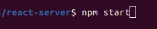
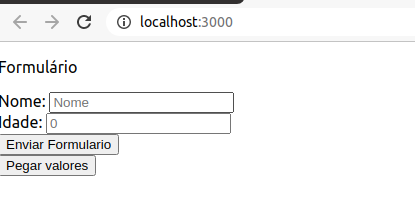
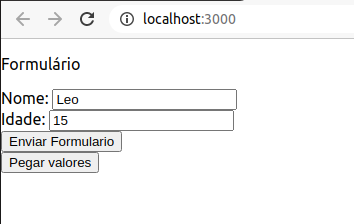
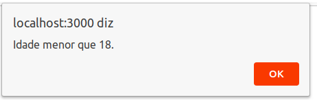
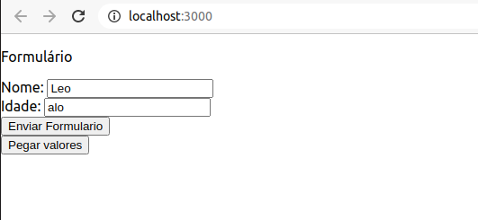
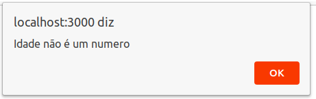
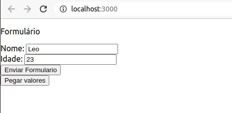
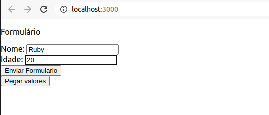
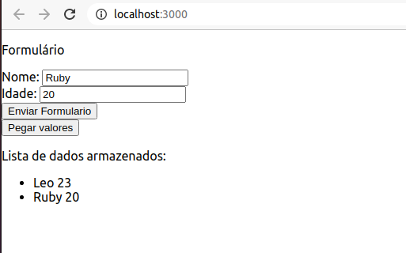

Sistema Operacional utilizado: Ubuntu 20.04

Para executar a aplicação utilizar o seguinte comando:

Durante a execução em **http://localhost:3000/** aparecerá a seguinte tela inicial:

Na imagem abaixo, foi testado o uso de uma idade menor que 18 anos:

Após o envio do formulário, o seguinte alerta aparecerá, apontando o fato que a idade é menor que 18:

Na imagem abaixo, foi testado o uso de um valor não numerico no campo de idade:

Após o envio do formulário, o seguinte alerta aparecerá, apontando que o valor de idade colocado não é numérico:

As imagens a seguir mostram dois formulários enviados com sucesso:

Dessa maneira, essas informações foram armazenadas em um file .json acessado pelo back-end, agora, clicando no botão **Pegar valores** a lista com os dados armazenadas será apresentada, como na figura abaixo:

